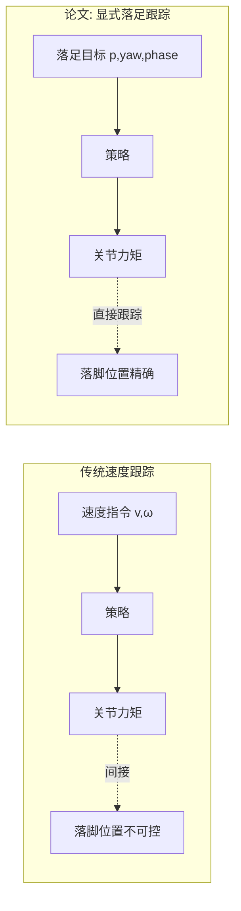
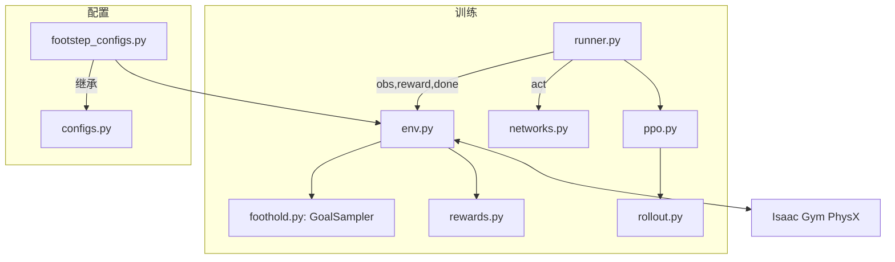
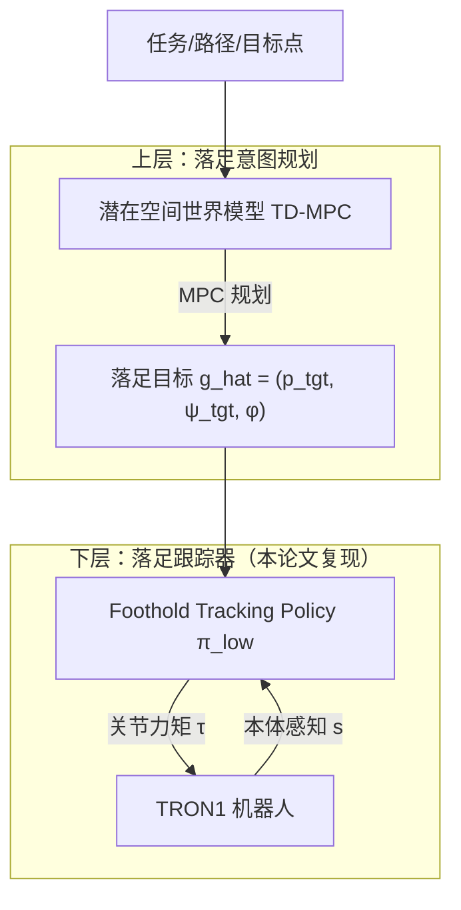

# Mind Your Steps 复现组会汇报

> **论文**：*Mind Your Steps: A General Learning Framework for Accurate Humanoid Foothold Tracking*
> **复现目标**：在 Isaac Gym 中为 TRON1A **PointFoot (PF, 6-DoF)** 与 **SoleFoot (SF, 8-DoF)** 复现论文的显式落足点跟踪（foothold tracking）学习框架，并作为分层控制系统中**下层控制器**的 baseline 与参考。
> **上层规划**：以 TD-MPC 类的小型潜在空间世界模型做落足意图（foothold intention）规划，复用本项目的低层落足跟踪策略。

---

## 目录

1. [论文背景与动机](#一论文背景与动机)
2. [问题建模](#二问题建模)
3. [方法](#三方法)
4. [复现代码结构与实现细节](#四复现代码结构与实现细节)
5. [复现进展](#五复现进展)
6. [作为分层控制的下层控制器：TD-MPC 上层规划](#六作为分层控制的下层控制器td-mpc-上层规划)
7. [附录：超参数与成功判据](#附录超参数与成功判据)

---

## 一、论文背景与动机

**传统人形机器人行走学习**通常把任务建模为**速度/朝向跟踪**（tracking a velocity command）：策略直接输出关节力矩去匹配某个质心线速度与角速度指令。这类方法存在两个结构性问题：

1. **指令空间与物理约束脱节**：速度指令不直接编码"脚应该落在哪里"，在复杂地形（台阶、石头、缝隙）上，速度跟踪策略只能通过间接奖励去"猜"安全的落脚位置，落足精度不可控。
2. **策略与规划难以解耦**：速度跟踪策略的输出是低层力矩，缺少一个可被上层规划器直接使用的、物理意义明确的中层接口。

**论文的核心思想**：把行走重新建模为**显式落足点跟踪**——策略的输入不是速度指令，而是一个具体的**落足目标**（位置 + 朝向 + 相位），策略被训练为"把摆动脚精确放到指定位置"的通用跟踪器。



这个建模带来三个关键收益：

- **落足精度**：直接以足端位置/朝向为跟踪目标，误差进入奖励，精度可控（论文报告厘米级落足误差）。
- **跨地形泛化**：同一个"落足跟踪器"可以搬到台阶、斜坡、废墟上，只需上层给出合适的落足目标。
- **天然的分层接口**：落足目标（每只脚 3 维位置 + 1 维 yaw）是一个**低维、稀疏、物理意义明确**的指令空间，非常适合作为上层规划器的输出。

---

## 二、问题建模

### 2.1 马尔可夫决策过程（MDP）

落足跟踪被建模为一个有限时长的 MDP $\mathcal{M} = (\mathcal{S}, \mathcal{A}, p, r, \gamma, T)$：

- **状态** $s_t \in \mathcal{S}$：本体感知 + 上一动作 + 落足目标 + 步态相位（见 2.2）。
- **动作** $a_t \in \mathcal{A} \subset \mathbb{R}^{n}$：$n$ 个关节相对名义姿态的位置目标偏移（PD 控制），$n=6$ (PF) / $n=8$ (SF)。
- **转移** $p(s_{t+1}\mid s_t, a_t)$：Isaac Gym 的 GPU PhysX 刚体动力学。
- **奖励** $r_t = \sum_i w_i r_i(s_t, a_t)$：见 2.4。
- **折扣与时长**：$\gamma = 0.995$，每 episode 20 s（策略频率 50 Hz，即 $T=1000$ 步）。

策略 $\pi_\theta(a_t \mid s_t)$ 是一个对角高斯分布：$\pi_\theta = \mathcal{N}(\mu_\theta(s_t), \mathrm{diag}(\sigma_\theta^2))$，其中 $\sigma_\theta$ 为可学习参数。

### 2.2 观测与动作空间

观测分为**本体感知**与**目标**两部分。**关键非对称性**：Actor 只接收本体感知与目标，**不接收**基座线速度、接触标志、接触力（这些是特权信息，只给 Critic 与奖励）。

**Actor 观测**（顺序拼接）：

$$
s_t^{actor} = \big[\underbrace{\,g_{proj}\,}_{3},\ \underbrace{\,q\,}_{n},\ \underbrace{\,\omega_{base}\,}_{3},\ \underbrace{\,\dot q\,}_{n},\ \underbrace{\,a_{t-1}\,}_{n}\big] \oplus \big[\underbrace{g_{goal}}_{16}\big]
$$

**Critic 观测**在 Actor 基础上加入基座线速度 $v_{base}\in\mathbb{R}^3$（无噪声版本）。

| 机器人 | DoF $n$ | 本体感知 $6+3n$ | 目标 | Actor 维度 | Critic 维度 |
|---|---:|---:|---:|---:|---:|
| PF (PointFoot) | 6 | 24 | 16 | **40** | **43** |
| SF (SoleFoot) | 8 | 30 | 16 | **46** | **49** |

**目标 $g_{goal} \in \mathbb{R}^{16}$** 的布局（论文 `GoalDoubleFootPlacement`）：

$$
g_{goal} = \big[\underbrace{p^{left}_{tgt}}_{3},\ \underbrace{q^{left}_{tgt,yaw}}_{4},\ \underbrace{p^{right}_{tgt}}_{3},\ \underbrace{q^{right}_{tgt,yaw}}_{4},\ \underbrace{\cos(2\pi\phi),\ \sin(2\pi\phi)}_{2}\big]
$$

其中 $p_{tgt}\in\mathbb{R}^3$ 为世界系落足位置；$q_{tgt,yaw}$ 为仅含 yaw 的单位四元数（Actor 侧使用 scalar-first $[w,x,y,z]$ 顺序）；$\phi\in[0,1)$ 为步态相位。目标在**当前支撑脚坐标系**中表示（相对位置与相对姿态），使策略对全局朝向不敏感。

### 2.3 控制：PD 位置跟踪

动作 $a_t$ 先裁切到 $[-1,1]$，再乘 `action_scale=1`，作为相对名义姿态 $q_0$ 的偏移：

$$
q_{tgt} = \mathrm{clamp}\big(q_0 + a_t,\ q_{min},\ q_{max}\big)
$$

PD 力矩（每关节）：

$$
\tau = K_p\,(q_{tgt} - q) - K_d\,\dot q,\qquad |\tau| \le \tau_{max}
$$

仿真步长 $dt=2.5\,\mathrm{ms}$，策略频率 50 Hz（`decimation=8`）。

### 2.4 奖励函数

总奖励为各项指数/指示奖励的加权和 $r_t = \sum_i w_i r_i$。核心是**摆动脚跟踪奖励**与**支撑脚锁存奖励**。

记摆动脚为 $\mathrm{sw}$、支撑脚为 $\mathrm{st}$，足端位置 $p$、yaw $\psi$、目标 $(p_{tgt},\psi_{tgt})$：

**摆动脚**（整段摆动相逐帧计算）：

$$
\begin{aligned}
r_{xy}^{swing} &= \exp\!\big(-\xi_{xy}\,\lVert p_{sw}^{xy} - p_{tgt}^{xy}\rVert^2\big) \\[2pt]
r_{z}^{swing}   &= \exp\!\big(-\xi_{z}\,(p_{sw}^{z} - p_{tgt}^{z} - h_{sw}\cdot \mathbf{1}[\phi_{half}\le 0.5])^2\big) \\[2pt]
r_{yaw}^{swing} &= \exp\!\big(-\xi_{yaw}\,\lVert \psi_{sw} - \psi_{tgt}\rVert^2\big)
\end{aligned}
$$

**支撑脚**（触地瞬间锁存，整段支撑相保持不变）：

$$
r_{xy}^{stance} = \exp\!\big(-\xi_{xy}\,\lVert p_{st}^{xy} - p_{tgt}^{xy}\rVert^2\big)\Big|_{touchdown},\qquad
r_{yaw}^{stance} = \exp\!\big(-\xi_{yaw}\,\lVert \psi_{st} - \psi_{tgt}\rVert^2\big)\Big|_{touchdown}
$$

**辅助项**：

- $r_{feet}$：二值离地奖励——摆动窗口 $|\phi - c|\le 0.1$ 内摆动脚必须离地（接触力 $< 1\,\mathrm{N}$）。
- $r_{gait\_height}$：单侧清障奖励，以相位三角权重 $\lambda(\phi_{half})$ 惩罚足高低于 $h_{sw}$。
- $r_{nominal}$：站立（hold）模式下奖励回到名义姿态。
- 正则项：$r_{base\_height},\ r_{action\_rate},\ r_{feet\_slip},\ r_{feet\_roll},\ r_{orientation},\ r_{torques},\ r_{energy},\dots$

**论文平地配置（Appendix F）**：令 $w_z = 0$（关掉 z 跟踪）、$w_{knee}=0$，保留 $w_{xy}=w_{yaw}=5$。

---

## 三、方法

### 3.1 落足目标采样器（Goal Sampler）

每个 episode 固定**运动方向** $\theta_m$ 与**足端朝向**；每次左右腿相位切换（半周期边界）采样下一个落足目标：

```text
SampleNext(swing, stance):
    d      ~ U(0.20, 0.50)            # 步长 (m)
    alpha  ~ U(-40°, 40°)             # 方向扰动
    beta   ~ U(-30°, 30°)             # 目标 yaw 扰动
    theta  = theta_m + alpha
    p_tgt  = p_stance + d * [cos(theta), sin(theta)]
    p_tgt.z += z ~ U(0, 0)            # 平地阶段 z = 0
    # 防交叉：在支撑脚 yaw 系下做单侧半平面裁切
    y_local = max/min(y_local, ±d_min),  d_min = 0.10 m
    yaw_tgt = stance_yaw + clamp(beta', -pi/2, pi/2)
    return (p_tgt, yaw_tgt)
```

**步态时钟**：频率固定 1.0 Hz；$\phi\in[0,0.5)$ 为左腿摆动、$[0.5,1)$ 为右腿摆动。以概率 $p_{hold}=0.10$ 进入站立（hold）模式，目标退化为名义脚间距，相位输入置零。

### 3.2 PPO 训练

采用**非对称 Actor-Critic + PPO**，观测与奖励均做 running normalization。

```text
for it = 1 .. 2442:                        # 8192 env × 50 steps ≈ 1e9 samples
    # ---- Rollout（并行环境）----
    for t = 1 .. 50:
        a_t ~ pi_theta(s_t)                # 对角高斯采样
        s_{t+1}, r_t, done <- env.step(a_t)
        store (s_t, a_t, r_t, done, log pi, mu, sigma)
    # ---- GAE ----
    A_t, R_t <- GAE(V_phi, gamma=0.995, lam=0.95)
    A_t <- (A_t - mean(A)) / std(A)        # 总体方差归一化
    # ---- PPO 更新（20 epochs, 1 minibatch）----
    for epoch = 1 .. 20:
        ratio = pi_theta(a|s) / pi_old(a|s)
        L_sur = max(-ratio*A, -clip(ratio,1±0.2)*A)
        L_val = 0.5 * clipMSE(V_phi(s), V_target)
        L     = L_sur + 0.5*L_val - 0.01*H(pi_theta)
        theta <- AdamW(theta, grad_clip=1.0, lr adaptive)
```

自适应学习率：初始 $10^{-5}$，范围 $[10^{-6}, 10^{-2}]$，KL 目标 0.02，margin/scale 1.5；每个 minibatch 用比率近似 KL 调节**下一次**更新的学习率。

### 3.3 域随机化与观测噪声

| 随机项 | 范围 |
|---|---|
| 摩擦 | $[0.5, 1.5]$ |
| 基座质量 | $\times [0.8, 1.2]$ |
| 连杆质量 | $\times [0.9, 1.1]$ |
| 基座 COM | $\pm 5\,\mathrm{cm}$ |
| $K_p$ | $\times [0.85, 1.15]$ |
| $K_d$ | $\times [0.5, 1.5]$ |
| 重力 | $[9.51, 10.11]\,\mathrm{m/s^2}$ |
| 随机 kick | 概率 0.4%，速度 $[0.1,0.4]\,\mathrm{m/s}$ |
| 观测噪声 | dof_pos 0.03, dof_vel 0.30, ang_vel 0.20, gravity 0.015 |

### 3.4 终止条件

论文 `HeightBasedTerminalStateHandler`：**仅按基座高度**判定失败。T1 目标高度 0.65 m、健康范围 $[0.30,0.90]$；映射到 SF 目标 0.75 m 时取**相同相对裕量** $[-0.35,+0.25]$ → $[0.40, 1.00]$ m。不沿用 TRON 基线的 projected-gravity / 接触终止。

---

## 四、复现代码结构与实现细节

### 4.1 目录结构

```text
mind-steps/
├── mind_steps/            # 核心包（纯 PyTorch + Isaac Gym，不依赖外部 RL 框架）
│   ├── configs.py         # PF/SF 基础配置（TRON1 基线事实来源）
│   ├── footstep_configs.py# 论文对齐的 foothold 配置与 CLI 覆盖
│   ├── env.py             # Isaac Gym 环境：仿真/PD/观测/奖励/终止/重置
│   ├── foothold.py        # FootholdGoalSampler + 四元数/坐标系变换
│   ├── rewards.py         # FootstepRewardComputer（每项奖励独立实现）
│   ├── networks.py        # ActorCritic + MLPEncoder
│   ├── ppo.py             # PPO（GAE、clip loss、自适应 lr）
│   ├── rollout.py         # RolloutStorage + Transition
│   ├── normalization.py   # 观测/奖励 running normalization
│   ├── initialization.py  # locomotion→foothold 的 actor 迁移
│   ├── physical_audit.py  # 支撑多边形/整机 COM 等物理审计
│   └── utils.py
├── scripts/               # 训练/评估/审计入口
│   ├── train_footsteps.py # 正式训练入口
│   ├── evaluate_footsteps.py  # 确定性评估 + 视频 + trajectory.npz 导出
│   └── ...（summarize、audit、benchmark 等）
├── tests/                 # 单元测试（foothold / normalization / ppo）
├── resources/             # PF/SF URDF + mesh（自包含复制）
├── pretrained/            # 只读的 locomotion checkpoint（审计用）
├── eval_data/  logs/      # 评估轨迹 / 训练日志
└── docs/                  # reproduction_spec.md、provenance.md、本报告
```

### 4.2 模块依赖与数据流



### 4.3 关键实现细节

**(a) 足端测量：sole-site 运动学。** Isaac Gym 暴露的是踝关节 link 原点，论文在**足底 site** 测量足端位置。实现为固定局部偏移 $r$ 的刚体 site 运动学（`foothold.rigid_body_site_state`）：

$$
p_{site} = p_{link} + R\,r,\qquad v_{site} = v_{link} + \omega \times (R\,r)
$$

SF 的 sole site 偏移为 $[0,0,-0.0599]$ m。这只是测量几何，不施加约束。

**(b) 支撑脚坐标系的观测。** 目标相对支撑脚的位姿用四元数共轭变换到支撑脚系（`rotate_inverse`），使策略对绝对朝向不变；yaw 四元数做符号规范化（$w<0$ 时取反）避免双覆盖。

**(c) touchdown 锁存（stance latch）。** 摆动脚触地的瞬间，把"最终摆动精度"的指数奖励写入 `stance_reward`，整段支撑相逐帧复用该常数。异步 reset 时只从 `last_switch_ids` 移除被 reset 的 env，不清空整个列表，否则会丢失其他 env 同一步的锁存。

**(d) 异步 reset 与目标 warm-up。** reset 返回的观测会清零动作、重建机体系速度与投影重力；rigid-body 状态要到下一帧物理刷新才可靠，故 goal 初始化延迟一帧（`goal_reset_pending`），先输出中性目标。论文 sampler 在 reset 后第一个半周期把目标放在当前脚姿态、stance latch 以满值 1.0 初始化，首次相位切换才采样首个非平凡目标。

**(e) 非对称 PPO 与归一化。** 观测 RMS 初始 count $10^{-6}$、方差加 $10^{-6}$，标准化后不裁切；奖励 return RMS 初始 count $10^{-4}$。网络各隐藏层用 gain $\sqrt{2}$ 的正交初始化、输出层 gain 0.01、bias 置零。这些与论文 Flax 实现逐项对齐（均有本地数值测试）。

**(f) 动作/PD 语义。** 论文把裁切后的网络输出直接作为 1 rad 位置目标偏移，裁切与力矩裁切分开；不能复用 TRON 基线里"根据实时 $q,\dot q$ 反推偏移范围"的状态依赖预裁切（会改变动作语义）。

---

## 五、复现进展

```text
[√] 论文 / 随附代码 / TRON1 基线的只读审计
[√] 自包含复制 PF/SF 资产与 Isaac Gym/PPO 基础代码
[√] 论文超参配置 + 16 维支撑脚系目标采样器
[√] 目标采样器接入 Isaac Gym 环境与论文奖励
[√] 非对称 PPO + running normalization + 完整指标记录
[√] 周期训练 MP4 与全物理状态 eval 导出（trajectory.npz）
[√] 8192 env SF stage-1 大规模训练链路 + 单迭代 GPU PhysX 冒烟测试
[ ] SF 平地稳定落足达标证据（当前在调探索/奖励/步长 curriculum）
[ ] PF 达标训练与评估
```

> **当前状态一句话**：训练链路与评估闭环已全部打通，正在进行 SF 平地的冷启动消融（步长 curriculum + 探索调度 + 真实 PD），目标先拿到稳定连续行走，再扩展到 PF 与 3D z-tracking。细节问题不做展开。

---

## 六、作为分层控制的下层控制器：TD-MPC 上层规划

### 6.1 为什么落足跟踪适合做"下层"

论文训练的落足跟踪策略是一个**通用的落足执行器**：输入本体感知 + 一个落足目标 + 相位，输出关节力矩，把脚精确放到位。它天然构成分层控制的**下层**，因为：

1. **指令空间低维且物理直观**：每只脚 $p_{tgt}\in\mathbb{R}^3,\ \psi_{tgt}\in\mathbb{R}$（4 维），远小于力矩空间（8 维）或全身状态。
2. **指令稀疏**：落足目标只需在每次相位切换更新一次（~1–2 Hz），而低层以 50 Hz 闭环执行。
3. **跨地形可复用**：同一个低层跟踪器可用于平地、台阶、斜坡，只需上层给不同的落足目标。

### 6.2 分层架构



接口定义：

$$
\begin{aligned}
&\text{上层（~1--2 Hz）: } & \hat g_{t:t+H} &= \mathrm{Plan}(z_t;\ \text{task})\\
&\text{下层（50 Hz）: } & \tau_t &= \pi_{low}\big(s_t^{proprio},\ \hat g_t,\ \phi_t\big)
\end{aligned}
$$

### 6.3 上层：TD-MPC 类小型潜在空间世界模型

**TD-MPC** 的核心是把 MPC 从高维状态空间搬到**小型潜在空间**里做，避免显式建全身动力学模型：

- 编码器把高维观测压成潜在状态 $z_t = h_\theta(s_t)$；
- 在潜在空间里学一个局部动力学模型 $d_\theta(z_t, a_t)$、奖励模型 $R_\theta(z_t, a_t)$ 与状态价值 $Q_\theta(z_t, a_t)$；
- 在线用带模型的 MPC（短视界 + 小动作预算，如 CEM / MPPI）规划动作序列，超出视界部分用 $Q_\theta$ 做终值。

MPC 目标（TD-MPC 的规划目标）：

$$
a_{t:t+H}^\star = \arg\max_{a_{t:t+H}}\ \mathbb{E}\Big[\sum_{k=0}^{H-1}\gamma^{k}R_\theta(z_{t+k},a_{t+k})\ +\ \gamma^{H}Q_\theta(z_{t+H},a_{t+H})\Big]
$$

$$
\text{s.t.}\quad z_{t+1}=d_\theta(z_t,a_t)
$$

**映射到本项目**：上层的"动作" $a^{up}$ 即**落足目标增量** $\Delta g$（或直接是落足目标 $g$）。潜在状态 $z_t$ 编码本体感知 + 低层策略状态。上层以 ~1–2 Hz 的落足频率做短视界 MPC，用 $Q_\theta$ 覆盖长视界任务（如"到达目标点""沿路径前进"），把每个规划步的第一个落足目标 $\hat g_t$ 下发给低层跟踪器。

**为什么这个组合合适**：

| 维度 | 传统端到端速度跟踪 | 本方案（TD-MPC 上层 + foothold 下层） |
|---|---|---|
| 上层动作空间 | 无（端到端） | 落足目标，低维（~4/脚） |
| 规划频率 | — | ~1–2 Hz，稀疏 |
| 世界模型规模 | — | 小型潜在空间模型即可 |
| 可解释/可验证 | 差 | 落脚点可视觉化、可审计 |
| 跨地形 | 需重新训练 | 下层复用，只换上层 |

**TD-MPC 侧重点（后续工作）**：潜在空间维度与编码器结构、MPC 视界/动作预算、$Q$ 值与奖励的归一化（TD-MPC2 的 value normalization 思路）、以及上层规划的**落足可行性约束**（把低层可达范围 $[0.08,0.5]\,\mathrm{m}$ 作为动作约束放进规划器）。

---

## 附录：超参数与成功判据

### A.1 PPO 超参数（论文附录）

| 参数 | 值 |
|---|---|
| 并行环境 | 8192 |
| 每迭代步数 | 50 |
| 总迭代 | 2442（≈ $10^9$ samples） |
| 网络 | ELU MLP $[512,256,128]$，正交初始化 |
| 动作 std 初值 | 0.135 |
| clip / entropy / value coef | 0.2 / 0.01 / 0.5 |
| epochs / minibatch | 20 / 1 |
| $\gamma$ / $\lambda$ | 0.995 / 0.95 |
| 学习率 | $10^{-5}$ 自适应，范围 $[10^{-6},10^{-2}]$ |
| grad norm / KL target | 1.0 / 0.02 |

### A.2 奖励权重（论文 Table V/VI，平地）

| 项 | 权重 | 项 | 权重 |
|---|---:|---|---:|
| survival | 0.25 | base_height | −10 |
| swing_xy / swing_yaw | 5 / 5 | action_rate | −3 |
| stance_xy / stance_yaw | 5 / 5 | feet_slip | −4 |
| feet_swing | 6 | feet_roll | −4 |
| gait_height | 4 | orientation | −5 |
| nominal_joint_pos | 4 | torques / energy | −$2\times10^{-4}$ / −$2\times10^{-3}$ |

sharpness：$\xi_{xy}=\xi_{yaw}=100,\ \xi_z=200,\ \xi_{gait}=100$；平地 $w_z=w_{knee}=0$。

### A.3 成功判据（不能只看存活）

- 连续运行时间、episode 长度、fall/reset rate；
- base 姿态/高度/速度/漂移；
- 每次 touchdown 的 2D/3D/yaw 误差与阈值成功率；
- 摆动窗口内是否离地、支撑脚滑动、错误脚触地；
- 动作/关节位置/速度/力矩/接触力轨迹；
- 视频中自然且持续的左右交替行走。

**目标**：至少一个 PF 或 SF agent 在平地稳定连续行走且能跟踪变化落足点，随后扩展另一形态与 3D z-tracking。
