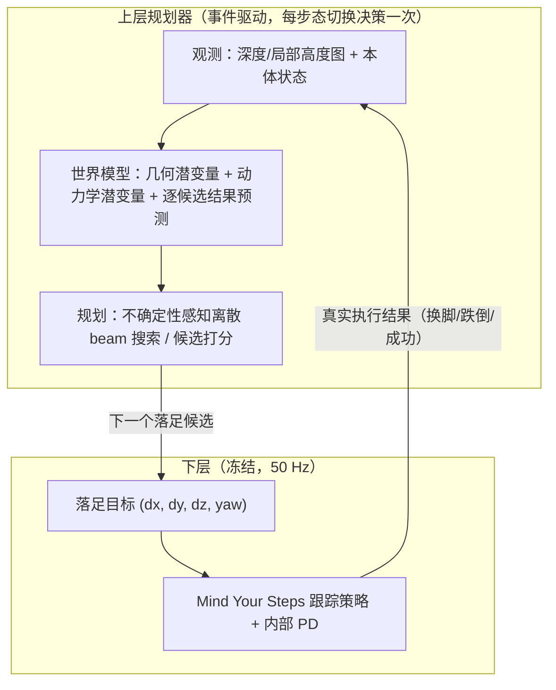

# 双足机器人上层落脚规划：从下层复现到世界模型规划

> 项目总体进展综述。本文面向人类读者，说明本次工作从头到现在的**结构、创新点、方法与代表性结果**，
> 不逐条罗列历史实验代号。各阶段的完整日志与自动结果见文末索引。
>
> 最后更新：2026-09-07。

## 摘要

本项目从复现论文 *Mind Your Steps* 的随机落足点跟踪（foothold tracking）出发，逐步构建了一套
**两层层次化控制框架**，并最终聚焦于一个核心研究问题：

> 在冻结的下层行走策略之上，能否学习一个**基于世界模型的落足点规划器**，使其在样本效率、
> 分布外地形适应与多步决策质量上超越模型自由（model-free）的基线？

围绕这一问题，工作经历了四个阶段：

1. **下层复现（`foothold/`）**：严格按论文复现 TRON1-SF 双足机器人（8 自由度）的随机落足跟踪
   RL 策略，冻结为后续所有上层工作的执行底座。
2. **上层基线（`upper_foothold_planner/`）**：用"特权几何教师蒸馏 + 非对称 PPO"训练出一个
   **只靠深度图 + 本体观测**即可部署的落足规划器，成功率 **95.5%**，显著超过特权教师（70.8%）。
3. **研究主线（`world_model_upper_planner/`，CG-OWM）**：重新实现 TD-MPC 风格的"世界模型 +
   规划"路线，针对上一版不收敛的根因做了**候选约束动作空间**与**不确定性感知离散 beam 搜索**
   等结构性改动，首次在闭环中证明了多步隐空间规划的收益。
4. **当前主线（三维下层 + 连续复合地图）**：将下层从"XY 平地落足"扩展到 **XYZ + yaw 三维落足**，
   把上层任务从"单一随机地形"升级为"单张地图中连续跨越七类地形的整路线导航"，并引入
   **物理锚定的未来展开**取代自由潜状态展开。

截止目前，最好结果包括：可部署落足规划器 **95.5%** 成功率（超过特权教师）；世界模型 beam 规划
在首个固定基准上 **77.1%**（相对同检查点贪心打分 +17.5 个百分点）；连续复合地图上最多 **42/64**
张路线完整到达（60 秒预算、严格稳定到达判据）。

---

## 1. 研究问题与总体架构

### 1.1 问题定义

机器人：**TRON1-SF 双足**，8 自由度（髋 × 2、膝 × 2、踝 × 2、偏航 × 2），脚掌面积很小，
ZMP 难以始终保持在支撑包络内，因此**零动作即摔倒属于正常物理现象**，站立保持不是本任务的目标。

任务分两层：

- **下层（50 Hz 控制）**：给定一个相对支撑脚的目标落足点 `(dx, dy, [dz], yaw)`，在一个物理仿真
  中跟踪该目标行走。下层是一个冻结的 RL 策略，训练时用论文的跟踪奖励闭环执行。
- **上层（事件驱动，每步态切换决策一次）**：在每个步态切换时刻，为下层选择下一个落足目标。
  一次上层决策对应一个**半马尔可夫选项（option）**——下层真实执行直到下一次换脚、跌倒或成功。

### 1.2 总体架构



### 1.3 信息边界（贯穿全项目的一条铁律）

项目反复强调并在代码中强制执行的边界：

- **部署观测**只有深度/局部高度图 + 本体状态，**绝不**在部署时读取地形生成器中心线、未来物理
  状态或完整地图。
- **特权信息**（精确支撑掩码、障碍几何、geodesic 距离场、绝对位姿）只在训练期供教师或 Critic
  使用，推理期全部丢弃。
- **下层冻结且不可改**：所有上层方法共享同一个下层检查点；对下层的任何改动都必须在独立目录
  （如 `lower_controller_3d/`、`adapters/`）中进行，并绑定 SHA-256 哈希，拒绝混合不同下层语义的
  数据。

---

## 2. 下层：Mind Your Steps 落足跟踪复现（`foothold/`）

### 2.1 方法原理

论文的核心机制是**随机落足目标 + 物理支撑面**：

1. 在每个步态切换时刻，在支撑脚坐标系下采样一个目标 `(dx, dy, yaw)`（论文设定
   `dx∈[0.2,0.5]m`、`dy` 按角度 ±30° 解码、`yaw∈[-30°,30°]`）；
2. 在该目标处放置一个物理支撑柱，使落足目标成为**真实可踩的几何**；
3. 用跟踪奖励（摆动脚位置/姿态、步态高度、支撑质量等）让策略学会精确踩到目标；
4. 域随机化（地板摩擦、关节阻尼/摩擦、质量/COM、PD 增益、重力、随机踢动）与
   **步长课程**（前 1000 轮从短步长逐步放大到全范围）保证鲁棒性。

驱动采用**位置模式 + 内部 PD**：RL 输出位置目标 `target = clamp(nominal + action, limits)`，
由 PhysX 内部的 `stiffness/damping`（来自 dof 属性）把位置目标转成力矩，不手动算 PD。

### 2.2 关键工程修正

复现过程中修复的、对稳定性有决定作用的几个问题：

- **done 掩码被清零**：`_reset_idx` 会清零 `reset_buf`，导致训练循环拿到的 `done` 恒为 0，
  GAE 的 episode 边界无法截断。新增独立的 `done_buf` 在重置前保存。
- **重置后 1 帧坍塌**：IsaacGym 瞬移关节体后派生 link 状态不会立即重算，下一次 `simulate`
  会数值爆炸导致机器人瞬间趴地（高并行度下 99.6%）。在 `set_root` + `set_dof` 之后补 2 个
  零力矩仿真子步做"落定"，趴地率降到 0。
- **倾覆漏检**：论文只按基座高度终止，侧翻/后翻时躯干落地但高度仍 >0.40，不重置。补充
  `projected_gravity_z` 判据（躯干约倾斜 60° 判倒）。

这些修正使下层能稳定行走并精确跟踪落足目标，冻结后的检查点（`lower_model_7000.pt`）成为
上层工作的统一执行底座。

---

## 3. 上层基线：特权教师蒸馏 + 非对称强化学习（`upper_foothold_planner/`）

这一阶段回答了一个前提问题：**在冻结下层之上，什么样的上层规划器是可部署且足够强的？**
它同时是后续世界模型工作的强基线。

### 3.1 动作空间：294 个离散候选

上层动作归一化到 `(f, l, ψ)∈[-1,1]³`，解码为支撑脚 yaw 系下的位移与转向：

$$(x_f, y_l, \psi_{\deg}) = \left(\tfrac{1+f}{2}\cdot 0.22 + 0.08,\ \operatorname{sgn}(s)\left[\tfrac{1+l}{2}\cdot 0.16 + 0.10\right],\ \psi\cdot 12^\circ\right)$$

候选为离散网格 `F₁₂ × L₉ × Ψ₃ = 324`，经径向可达域 `ρ∈[0.12, 0.35]m` 过滤后得到
**294 个候选**。离散化的意义：每个状态天然有多个可比较的动作，可以直接做分类/价值学习；
同时避免了早期连续参数化中 98.1% 样本退化到同一最小横向步的**动作别名**问题。

### 3.2 特权几何教师

教师是一个**确定性单步贪心几何规划器**（仅仿真可用），对每个候选计算三个量：

- **足底支撑率**：以 9 点足底模板近似脚掌，
  $F(x,y)=\frac{1}{9}\sum_{i,j\in\{-1,0,1\}} S(x+j\Delta x,\,y+i\Delta y)$，其中 $S$ 为高度场支撑掩码；
- **跳跃感知 geodesic 距离场**：在"可落足单元"图上以目标为源做 Dijkstra，边允许跨越无支撑
  间隙但禁止穿越障碍，得到 `d_geo(x)`——一串真实可踩落足序列的路径长度，而非连续地面距离；
- **路线朝向误差** `η_a`。

候选评分为 $\operatorname{score}(a)=10\Delta d_a + 3F_a - 0.25\eta_a - 0.04\|a-a_{prev}\|²$，
并满足支撑率、障碍、摆动路径等有效性约束。教师完全忽略下层动力学误差，这为学生超越它埋下空间。

### 3.3 学生蒸馏（行为克隆）

学生在 1024 个随机地形上收集教师决策，只保留成功 episode，按**地形实例**划分训练/验证
（验证集是未见地形，杜绝同场景重放冒充泛化）。学生网络为：

```
depth (1×64×64) → 4 层卷积 → 128 维地形特征
proprio (36)    → MLP → 64 维本体特征
concat(192) → 256 维融合特征
  ├─ 分类 logits   （策略）
  ├─ 可行性 logits （辅助）
  └─ geodesic 进度 （辅助）
```

关键是**软目标蒸馏**：不复制教师的 one-hot `argmax`，而是用温度分布
`q(a)=softmax(score(a)/τ), τ=0.25` 蒸馏教师对候选之间的**相对偏好**，损失为软目标交叉熵
+ 可行性 BCE + 进度 Huber。结果：学生闭环成功率 71.6%/70.0%，追平教师 70.8%——但也说明
行为克隆的上界就是教师，无法修正教师的系统性错误。

### 3.4 非对称 PPO：学生超越教师

- **Actor** 保持可部署观测（深度 + 36 维本体）；
- **Critic** 额外访问特权特征（geodesic 距离、支撑率、支撑脚/基座世界坐标，共 42 维），
  只在训练期存在；
- **奖励**为 geodesic 势能整形：

$$r_t = \underbrace{\Phi(s_{t+1}) - \gamma\Phi(s_t)}_{\text{geodesic 前进势差}} + 10\cdot\mathbb{1}_{success} - 5\cdot\mathbb{1}_{collision} - 5\cdot\mathbb{1}_{fall} - 3(1-F_{land}),\quad \Phi(s)=-d_{geo}(s)$$

势能整形保证绕障所需的侧向移动不会被欧氏距离误罚。PPO 直接优化真实折扣回报，并借助学到的
值函数隐式建模多步后果与动力学可行性，因此能找到偏离教师贪心选择、但真实成功率更高的序列。

最终：贪婪评估 seed 924 = **95.5%**、seed 42 = **95.1%**，**以更少观测超过特权教师（70.8%）**。
分布外测试（窄支撑 72.2%、大间隙 81.0%、极限组合 18.7%）表明策略确实在感知地形几何并自主规划，
同时标定了其在冻结下层物理极限处的能力边界。

---

## 4. 研究主线：候选约束选项世界模型 CG-OWM（`world_model_upper_planner/`）

上一版（`upper_foothold_planner/` 早期 V1–V4）试图用**连续 CEM + 隐空间完整观测重建**学习
落足动力学，未收敛。`world_model_upper_planner/` 是独立重写，针对失败根因做了结构性改动。

### 4.1 假设与边界

> 一个专门为**闭环落足选项**设计的世界模型，只要表示与规划被候选几何扎根、并约束到冻结下层
> 经验可达的动作集上，就能在样本效率与分布外地形适应上超越模型自由基线。

方法可证伪：若在**匹配观测、动作候选、下层、地形划分与环境交互**的前提下仍不能击败
师生/PPO 基线，则假设被证伪。

### 4.2 模型结构

每次上层动作是一个**半马尔可夫选项**：选一个落足候选，让冻结下层执行到下一次真实步态边界，
再观测机器人级结果。模型包含：

1. **分离的几何与动力学潜变量**：从深度与可部署本体观测中分别提取几何潜变量与动力学潜变量，
   各 64 维、使用 SimNorm，而非把两者混在一个重建导向的隐空间中；
2. **选项条件潜转移**：`ẑ_{t+1} = f_θ(z_t, a_t)`，在每一个想象步上对齐真实下一观测的
   **EMA 编码**（`h_EMA(o_{t+1})`），而不是对齐整张深度图；
3. **逐候选并行结果预测**：progress、support、touchdown 误差、collision、fall、continuation、
   reward 与 twin Q，全部对 294 个候选并行输出；
4. **仅训练期的特权几何监督**：支撑、障碍膨胀可通行性、geodesic 进展与触地误差；
5. **不确定性感知的离散 beam 搜索**：在经验可达候选集上做离散 beam 搜索，配学习得到的
   proposal 先验与悲观终端 Q。

方法**刻意不含**学到的"目标概率头"（成功是已知任务逻辑）、**不含连续 CEM**、**不含无约束
动作立方体**。

### 4.3 从失败前任中固化的原则

- **动作别名**：使用与所有基线相同的有限 Cartesian 候选集；
- **潜空间利用**：真实下一观测 EMA 一致性、短时域、集成分歧、强制 horizon-1 诊断先行；
- **稀有事件失准**：报告正例率、Brier 分数与校准，安全头是罚项而非高权重合成成功奖励；
- **在线反馈不稳**：冻结采集阶段与离线更新阶段交替，不逐转移更新；
- **损失趋势误导**：只用固定 seed 的闭环 episode 结果与视频检查来晋升检查点。

### 4.4 首个闭环收益证据

固定 seed 924、random-composite、64 环境 × 30 s，同一检查点下三种决策规则的对比：

| 决策规则 | 成功率 | 每步 progress |
|---|---:|---:|
| H3 向量化 beam 规划 | **77.1%**（222/288） | 0.212 m |
| H1 学习打分 | 59.5% | 0.202 m |
| proposal 先验 | 63.6% | 0.200 m |

多步隐空间规划相对同检查点的 H1 贪心打分带来 **+17.5 个百分点**，是首个世界模型规划收益的
闭环证据。后续多地形扩展（V2）在 held-out seeds 上把 household 从 25.2% 提到 58.5%、
stepping stones 从 60.6% 提到 70.8%，并确认 **turns（急转弯）是持续失败域**——这直接导向了
后续"三维下层 + 连续复合地图"的主线转向。

---

## 5. 当前主线：三维下层 + 连续复合地图（`lower_controller_3d/` + `composite_terrain/`）

前几轮结论表明：急转弯、窄桩面上的落足可行性与下层 yaw 实现能力是瓶颈，而单场景扩量收益递减。
因此主线转为两件事：**让下层能走 XYZ**，以及**在一张连续地图上完成跨多类地形的整路线导航**。

### 5.1 三维下层

独立目录 `lower_controller_3d/` 复制并独立维护下层，关键改动：

- 动作目标从 `(dx, dy, yaw)` 扩展到 **`(dx, dy, dz, yaw)`**，其中目标高度相对支撑脚
  `p_target,z = p_stance,z + dz`；
- **轮换的空闲支撑柱**：每次采样后为该目标放置物理支撑柱（24×16 cm 柱顶），采样与碰撞
  可行性检查先于物理执行，目标生成禁止从既有地形反查；
- 高度课程：从小幅上下台阶逐步拓宽到 ±4 cm。

验收（±4 cm 高度目标，64 env × 20 s，两 seed）：**93.75%–95.3% 环境全程无跌倒**，
XY/Z 中位误差约 3.2 / 0.1 cm。检查点 `lower3d_v2_z04/model_7200.pt` 冻结（约 200 迭代、
20.5M 名义交互、651 s）。此后下层不再改动。

### 5.2 连续复合地图

上层任务从"随机单一地形"升级为：**一张静态地图，每条 episode 沿一条 18.8 m 连续路线跨越
七类地形区域**（坡、台阶、梅花桩、窄桥、曲线窄路、障碍绕行、不平地/碎块），60 秒预算，
从路线起点出发。

- **动作**：`a_t = (x, |y|, dz, yaw)`，**180 个离散候选**（4×3×5×3）：`x∈12–30 cm`、
  `y∈12–24 cm`、`dz∈{-8,-4,0,4,8} cm`、`yaw∈{-6,0,6}°`，在支撑脚 yaw 系解码；
- **观测**：`o_t = (H_t, p_t)`，当前 64×64 真实局部高度图（相对支撑脚高度，范围 3.15 m）
  + **75 维状态**。状态里额外内嵌了**下层当前 16 维目标观测与两帧关节动作历史**，用于消除
  "相同身体姿态但保留落脚目标/控制历史不同"造成的闭环转移混叠；
- **严格到达判据**：进入终点 30 cm 范围 + 直立 + 机身高度正常 + 无非脚碰撞 + 维持 200 ms。

### 5.3 物理锚定的未来展开（关键结构变化）

V4 用自由潜状态做三步展开，结果 H3 明显负收益（H1 23/64，H3 仅 4/64）。由此引入**物理锚定**：

$$\underbrace{(\Delta x, \Delta y, \Delta yaw, \Delta z_{stance},\ \hat p_{next})}_{\text{学习闭环运动}} = F_θ\big(h(H,p),\ p,\ a\big)$$

- **当前静态地图缓存** `M`（128×128 局部缓存）是真实已观测量，未来地形不再由潜状态凭空生成；
- 模型只预测**身体位移/转向、支撑高度变化与下一控制状态**，再用这些预测从同一个 `M` 重投影
  出未来的局部观测，送入结果模型；
- 监督来自冻结下层**真实执行**的转移，而非"完美跟踪目标"的运动学假设。

这显著缓解了旧 H3 的负增益：V5 物理锚定后 H1 **32/64**、H3 29/64（自由潜状态 H3 仅 4/64）。
但后续扩量（V6/V7/V8）后 H3 仍未稳定超过 H1，因此当前**默认规划器是 H1**，不再盲目加深时域。

---

## 6. 核心创新点

1. **候选约束动作空间**：把上层动作固化为 294（后续 180）个经验可达的离散落足候选，
   从根源上消除连续参数化的动作别名，使分类/价值/优势学习成为可能，并让每个状态天然拥有
   可比较的动作集合。

2. **候选几何扎根的世界模型（CG-OWM）**：几何与动力学潜变量分离，选项级潜转移对齐
   **EMA 下一观测编码**（而非视觉重建），逐候选并行预测结果——把"世界模型"从视觉自编码
   拉回到"任务/动力学预测"。

3. **不确定性感知的离散 beam 搜索**：用离散 beam 搜索 + proposal 先验 + 悲观终端 Q 替代
   连续 CEM，在经验可达集上做多步规划，并给出首个"多步规划优于贪心打分"的闭环证据。

4. **特权教师蒸馏 + 非对称 RL，学生超过教师**：软目标蒸馏让学生追平教师；非对称 PPO
   （可部署 Actor + 特权 Critic）配 geodesic 势能整形奖励，让学生以**更少观测**超过教师
   （95.5% vs 70.8%），证明其学到了比手写评分更有效的规划。

5. **物理锚定的未来展开**：不再用自由潜状态生成未来地形，而是"静态地图缓存 + 学习闭环
   SE(2) 位移 + 重投影"，把未来想象约束在真实已观测几何上，显著缓解多步展开的退化。

6. **严格的信息边界与可证伪协议**：部署/特权、训练/推理、冻结下层哈希绑定、固定 seed 闭环
   晋升、失败视频全保留——这些工程纪律使"世界模型是否真的有用"可以被严格检验，而不是被
   损失曲线或单条成功视频掩盖。

---

## 7. 代表性中间结果

| 阶段 | 结果 | 含义 |
|---|---|---|
| 下层复现 | 稳定行走 + 精确落足跟踪；冻结 `lower_model_7000.pt` | 上层工作的统一底座 |
| 教师蒸馏 | 学生 BC 71.6% / 70.0% ≈ 教师 70.8% | 蒸馏可达教师上界 |
| 非对称 PPO | **95.5% / 95.1%**，超过教师 | 可部署基线，模型自由方法的天花板 |
| CG-OWM 首个闭环 | beam **77.1%** vs H1 59.5% / prior 63.6% | 首个世界模型规划收益证据 |
| V2 多地形 | household 25.2→58.5、stones 60.6→70.8 | 跨地形泛化成立，turns 失败 |
| V6 障碍可见性 | household 49.9/32.5 → **77.6/61.3**；bridge 94.7–100、irregular 77.7–96.5 | 修正特权观测缺障碍 |
| 三维下层 | 93.75–95.3% 环境 20 s 无跌倒，XY/Z 中位 3.2/0.1 cm | XYZ 落足能力成立 |
| 连续地图（物理锚定） | V5 H1 32/64；V6 H1 **42/64**（较易）、难图 29/64 | 完整混合路线可走通，但未近全完成 |

---

## 8. 截止目前最好结果

三条线各自的最好结果（任务与尺度不同，不可直接互比）：

**（a）可部署上层落足规划（模型自由，`upper_foothold_planner/`）**

| 策略 | 观测 | seed 924 | seed 42 |
|---|---|---|---|
| 特权教师 | 全量 heightfield | 70.8% | — |
| 蒸馏学生 BC | 深度 + 本体 | 71.6% | 70.0% |
| **非对称 PPO** | **深度 + 本体** | **95.5%** | **95.1%** |

**（b）世界模型规划（CG-OWM，`world_model_upper_planner/`）**

- 首个固定基准（seed 924）：beam 规划 **77.1%**，相对 H1 打分 +17.5 pp；
- 多地形 held-out seeds（V2）：edge 81.6%、random 71.3%、stones 70.8%、household 58.5%、
  mixed 61.3%、turns 13.6%；
- 大规模训练（V6，18.4M 交互）：household nominal/hard **77.6%/61.3%**、bridge **94.7–100%**、
  irregular **77.7–96.5%**；edge hard 25.5%、stones hard 20.4% 仍是失败域。

**（c）连续复合地图整路线导航（当前主线）**

- 较易路线（seed 9601，难度 0.25）：V6 H1 **42/64** 张完整到达，66 次跌倒；
- 难路线（seed 9801/9901，难度 0.5）：V8 H1 **29/64** 与 **26/64** 张到达；
- 代表成功视频：37.14 s 完整走完七类路线、0 跌倒（严格稳定到达判据）。

---

## 9. 当前瓶颈与下一步

- **急转弯（turns）**仍是贯穿各版本的失败域，指向"下层 yaw 实际转角能力"这一动作接口边界；
- **梅花桩 / 窄桥边缘**的失败表明"目标几何可行"与"实际闭环落脚可行"之间存在差距（下层执行
  误差是上界的一部分）；
- 多步展开（H3）在物理锚定后已不再是负收益，但尚未稳定超过 H1，继续加深时域不划算；
- 当前 V9 正用"12% 当前支撑候选探索"补充真实动作覆盖（计划 1024 新布局、6.1M 新增交互），
  检验**数据覆盖**而非**模型深度**是否是瓶颈。

---

## 附录：文档索引

- 下层复现：`docs/reproduction_spec.md`、`docs/foothold_goal_analysis.md`、`docs/normalization_and_checkpoint.md`
- 上层基线方法：`upper_foothold_planner/docs/teacher_distillation_report.md`
- 世界模型方法：`world_model_upper_planner/docs/method.md`、`world_model_upper_planner/README.md`
- 连续地图方法/计划：`world_model_upper_planner/docs/composite_3d_method.md`、`composite_3d_plan.md`
- 逐日进度与自动结果：`world_model_upper_planner/docs/progress_2026-09-07.md`、`composite_3d_experiments.md`
- 历史决策日志：仓库内存笔记 `/memories/repo/mind-steps-debugging.md`（供追溯，非对外文档）
