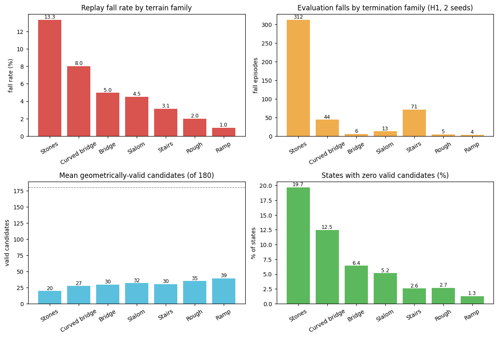
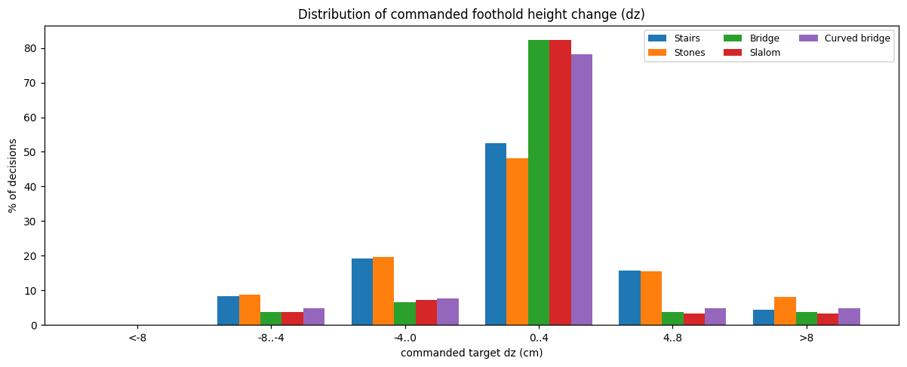

# 高失败率场景统计与失败原因分析

日期：2026-09-07。数据来源：第二轮硬地形训练（`composite3d_hard_big`）的
评估 episode（`h1_64_seed{9801,9901}`，难度 0.5，64 图 × 60 s）与合并后的
采集 replay（671k 转移）。统计脚本：`scripts/analyze_failures.py`。

## 结论摘要

1. **失败高度集中在梅花桩（stones）**：评估中 455 次跌倒里 **312 次（68.6%）** 发生在
   梅花桩，其次是台阶 71 次（15.6%）、曲线窄桥 44 次（9.7%）。
2. **主因不是下层能力不足**：新下层在 ±6 cm 高度目标上 0 跌倒，且斜坡/窄桥/绕障/台阶/
   不平地的转移跌倒率只有 1–5%。**梅花桩是唯一特例（13.3% 跌倒 + 18.6% 碰撞）**。
3. **主因是梅花桩上"上层几何候选集不足 + 高度动作分辨率不足"**：
   - 梅花桩上平均只有 **19.7 / 180** 个几何有效候选，**19.7% 的状态一个有效候选都没有**
     （25.3% 状态 ≤3 个），而平地斜坡有 39.3 个、0 候选率仅 1.3%；
   - 跌倒状态的平均有效候选只有 **7.3 个**（安全状态 31.8 个）；
   - 跌倒状态平均命令高度变化 **|dz|≈4.3 cm**（安全状态 ≈1.5 cm），梅花桩的 dz 分布明显
     向 ±4–8 cm 甚至 >8 cm 的长尾集中——而候选 dz 上限 8 cm、下层验收 ±6 cm，相邻桩顶
     高差最大可达 ~10 cm，已超出可执行范围。
4. 次要因素：窄桩放大了落足误差（梅花桩触地 XY 误差中位 **14.5 cm**，桩宽仅 ~19–22 cm），
   导致即使选中的候选也经常踩空失稳。

---

## 1. 失败集中在哪些地形

上图（左上、右上）分别为采集 replay 的**转移跌倒率**与评估的**跌倒 episode 数**：

| 地形 | replay 跌倒率 | 评估跌倒数（2 seed） | 占比 | 评估成功数 |
|---|---:|---:|---:|---:|
| **梅花桩 stones** | **13.3%** | **312** | **68.6%** | 3 |
| 台阶 stairs | 3.1% | 71 | 15.6% | 4 |
| 曲线窄桥 curved_bridge | 8.0% | 44 | 9.7% | 2 |
| 绕障 slalom | 4.5% | 13 | 2.9% | 3 |
| 窄桥 bridge | 5.0% | 6 | 1.3% | 3 |
| 不平地 rough | 2.0% | 5 | 1.1% | 0 |
| 斜坡 ramp | 1.0% | 4 | 0.9% | 1 |

> 注：评估中 **0 次 timeout**——所有未完成 episode 都以跌倒结束；梅花桩的平均最远前进仅
> 5.8 m（总路线 18.8 m），说明机器人通常在梅花桩区前半段就失稳。

---

## 2. 候选集是否足够（回答"几何可选落足点范围不够"）

上图（左下、右下）为各地形**平均几何有效候选数**与**零有效候选状态占比**：

| 地形 | 平均有效候选（/180） | 0 候选状态占比 | ≤3 候选状态占比 |
|---|---:|---:|---:|
| **梅花桩 stones** | **19.7** | **19.7%** | **25.3%** |
| 曲线窄桥 curved_bridge | 27.4 | 12.5% | 15.7% |
| 窄桥 bridge | 29.8 | 6.4% | 8.8% |
| 绕障 slalom | 31.9 | 5.2% | 7.3% |
| 台阶 stairs | 30.2 | 2.6% | 3.2% |
| 斜坡 ramp | 39.3 | 1.3% | 1.6% |

**跌倒 vs 安全状态的候选可用性对比**（全地形合并）：

| 状态 | 平均有效候选 | 平均命令 \|dz\| | 平均落足支撑率 |
|---|---:|---:|---:|
| 跌倒状态 | **7.3** | **0.54（≈4.3 cm）** | 0.09 |
| 安全状态 | 31.8 | 0.19（≈1.5 cm） | 0.93 |

梅花桩是唯一一个"平均候选数低 + 零候选率高达 20%"的地形。**这说明在梅花桩上，180 个
离散候选里大多数因支撑判定不达标而被过滤，规划器经常面临几乎没有选择余地的局面**——
这正是"几何可选落足点范围不够"的直接证据。

---

## 3. 高度动作是否触发失败（回答"是否超出下层能力"）

上图是各地形**命令高度变化 dz 的分布**（候选 dz 量化级别为 ±8 / ±4 / 0 cm）：

- 窄桥、绕障、曲线窄桥 ~80% 决策是 0–4 cm（几乎不需要大高度变化），跌倒率也低；
- **梅花桩和台阶明显更依赖大 dz**：±4–8 cm 桶占比显著更高，梅花桩还有 ~8–10% 的决策
  落在 >8 cm 长尾（即候选 dz 已顶到 +8 cm 上限）；
- 跌倒状态平均 |dz| 是安全状态的 **2.8 倍**（4.3 cm vs 1.5 cm）。

结合下层验收结果（±6 cm、0 跌倒）可得：**下层本身不是瓶颈**——真正的问题是梅花桩的
**相邻桩顶高差最大 ~10 cm，超出了候选 dz 上限（8 cm）和下层验收范围（6 cm）**，而
规划器又常常只剩少数高 dz 候选可选，被迫执行接近/超出能力边界的高度变化。

---

## 4. 因果归因（回答问题）

| 假说 | 数据支持 | 结论 |
|---|---|---|
| 场景难度超出下层能力 | 下层 ±6 cm 0 跌倒；除梅花桩外各地形跌倒率仅 1–5% | **否**（多数地形下层可行） |
| 上层几何候选集范围不够 | 梅花桩 0 候选状态 19.7%、≤3 候选 25.3%、平均仅 19.7/180 | **是，主因之一** |
| 高度动作分辨率/上限不足 | dz 量化 ±4 cm 步进、上限 8 cm；相邻桩高差最大 ~10 cm；梅花桩 >8 cm 长尾 ~8–10% | **是，主因之一** |
| 窄桩放大落足误差 | 梅花桩触地 XY 中位 14.5 cm（桩宽 ~19–22 cm）、支撑率 0.70（最低） | **是，次要因素** |

### 一句话结论

> 失败主要**不是**下层能力不足，而是**梅花桩场景下上层几何候选集不足 + 高度动作分辨率
> 不足**：180 个离散候选（含 ±4 cm 步进的 dz 量化）无法在 ±5 cm 高、19–22 cm 宽的桩上
> 提供足够多"几何可行且动力学可达"的落脚选项，20% 的状态甚至无候选可选；叠加窄桩对
> 落足误差的放大，导致梅花桩成为 68.6% 跌倒的来源。

---

## 5. 建议方向（待验证，不盲目扩量）

1. **细化高度动作**：dz 步进从 4 cm 改 2 cm（候选数 180 → 更多），或让候选 z 直接取
   "当前观测高度图上该落点的实际高度"而非固定步进——让模型能精确落在桩顶；
2. **改进候选支撑判定**：用真实足底网格包络（~18×5 cm）联合落足误差判定，替代
   "±8×3.5 cm 模板 + 2.8 cm 硬容差"，避免把本可踩的窄桩误判为无效；
3. **为"0 候选"状态提供回退动作**（原地踏步/小步调整），而不是从无效候选中强制选；
4. 或者接受梅花桩为"动作接口边界"，单独诊断相邻桩高差 >6 cm 的占比，决定是否要
   扩大下层 z 验收到 ±8 cm。

（第 1–3 项是可实现的上层改动；第 4 项涉及下层，需单独决策。）
